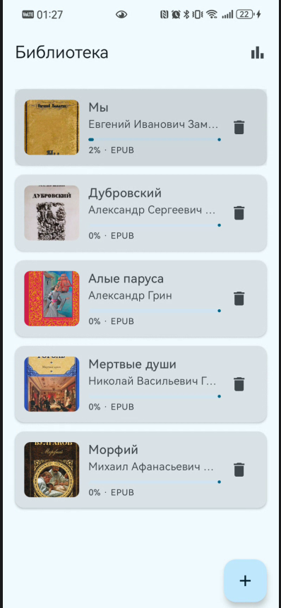
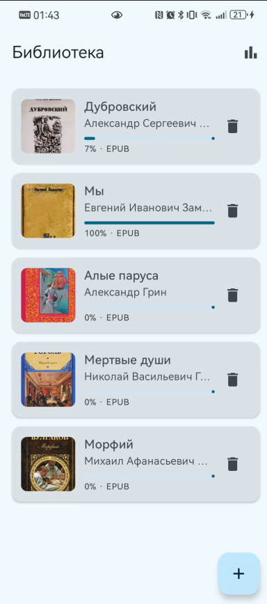
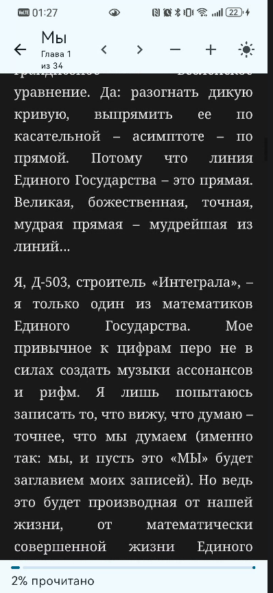
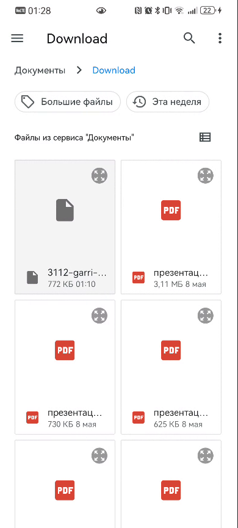
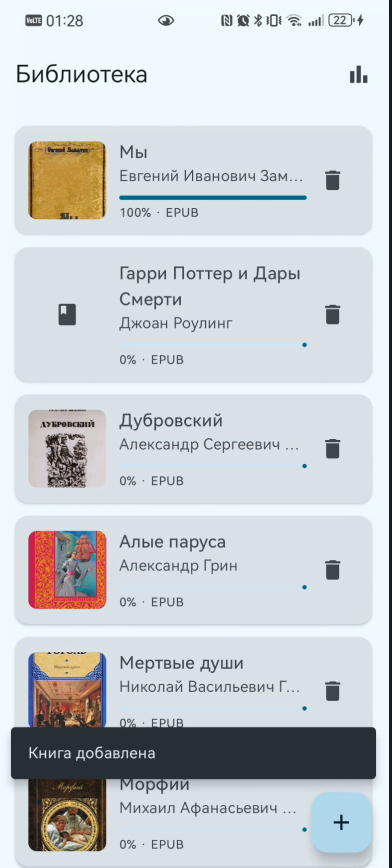
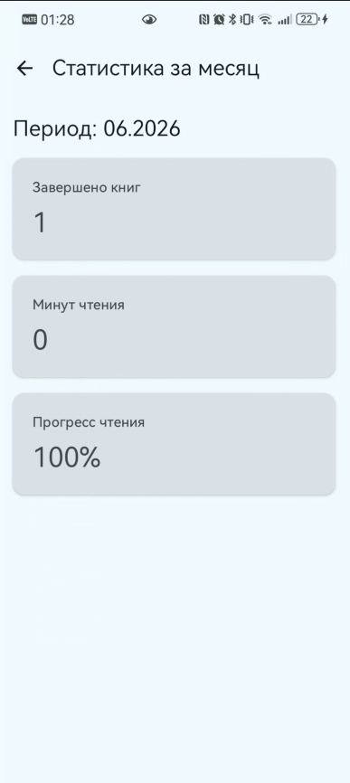

# Внешний репозиторий с файлами проекта: https://github.com/RinaGrisse/Library
# Project Name: Библиотека (PVIMS Library)

## Description

Мобильное приложение-библиотека для Android, разработанное в рамках проекта ПМВС. Приложение отображает каталог загруженных книг в форматах EPUB и FB2, извлекает обложки из EPUB, сохраняет прогресс чтения и открывает книги во встроенной читалке. На главном экране доступны добавление новых книг, просмотр статистики чтения за текущий месяц и переход к полноэкранному режиму чтения. Данные хранятся в базе Room, импорт и разбор книг выполняются в фоновых потоках, метаданные дополняются через Open Library API.

## Installation

1. Клонируйте репозиторий: `git clone https://github.com/RinaGrisse/Library`
2. Откройте проект в Android Studio (Giraffe или новее).
3. Убедитесь, что установлен Android SDK 36 и JDK 17 (рекомендуется JBR из Android Studio).
4. Синхронизируйте Gradle (`Sync Project with Gradle Files`).
5. Подключите устройство или эмулятор с API 24+.
6. Соберите и установите приложение: `./gradlew installDebug` или Run в IDE.

Предустановленные книги лежат в `app/src/main/assets/books/` (копия каталога `books/` в корне репозитория) и импортируются при первом запуске.

## Usage

### Главный экран — каталог

Список книг с обложкой, автором и прогрессом. Иконка диаграммы — статистика, FAB «+» — добавление EPUB/FB2, корзина — удаление.





### Читалка

Нажмите на книгу. Листайте текст пальцем, переключайте главы стрелками, меняйте шрифт (±) и тему (солнце).




### Добавление книги





### Статистика за месяц



Подробная галерея: [wiki/Screenshots.md](wiki/Screenshots.md).

## Contributing

| Участник | Курс | Группа | Направление | Задачи |
|----------|------|--------|-------------|--------|
| **Головина Екатерина** | 3 | 11 | МСС | UI, читалка, парсеры EPUB/FB2, CI, документация |
| **Галяш Александра** | 3 | 11 | МСС | Room, репозиторий, Open Library API, тесты, wiki |

## Документация проекта

| Документ | Ссылка |
|----------|--------|
| Wiki — главная | [wiki/Home.md](wiki/Home.md) |
| Функциональные требования | [wiki/Functional-Requirements.md](wiki/Functional-Requirements.md) |
| Диаграмма файлов | [wiki/File-Structure.md](wiki/File-Structure.md) |
| Схема БД | [wiki/Database-Schema.md](wiki/Database-Schema.md) |
| Доп. спецификация | [wiki/Additional-Specification.md](wiki/Additional-Specification.md) |
| Скриншоты | [wiki/Screenshots.md](wiki/Screenshots.md) |
| Презентация | [docs/presentation.md](docs/presentation.md) |
| SQL-схема | [database/schema.sql](database/schema.sql) |

## Сборка и CI

```bash
./gradlew test assembleDebug
```

GitHub Actions (`.github/workflows/android-ci.yml`): unit-тесты, сборка APK, instrumented-тесты на эмуляторе, публикация артефакта `app-debug.apk`.

## Технологии

- Kotlin, Jetpack Compose, Navigation Compose
- Room (SQLite), Coroutines
- WebView-читалка, парсинг EPUB/FB2
- Open Library API (OkHttp)
- JUnit, Robolectric, AndroidJUnit4, GitHub Actions
