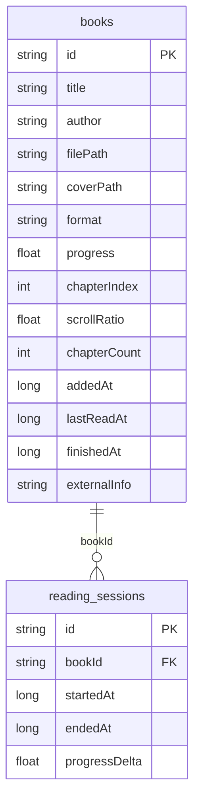

# Схема базы данных

База данных приложения реализована на **SQLite** через библиотеку **Room**. Имя файла БД: `library.db`.

## ER-диаграмма



## Таблица `books`

Хранит каталог книг и состояние чтения.

| Поле | Тип | Описание |
|------|-----|----------|
| `id` | TEXT PK | UUID книги |
| `title` | TEXT | Название |
| `author` | TEXT | Автор |
| `filePath` | TEXT | Путь к EPUB/FB2 во внутреннем хранилище |
| `coverPath` | TEXT | Путь к файлу обложки (JPEG) |
| `format` | TEXT | `epub` или `fb2` |
| `progress` | REAL | Прогресс 0.0–1.0 |
| `chapterIndex` | INTEGER | Индекс текущей главы |
| `scrollRatio` | REAL | Позиция прокрутки в главе 0.0–1.0 |
| `chapterCount` | INTEGER | Число глав |
| `addedAt` | INTEGER | Unix-ms дата добавления |
| `lastReadAt` | INTEGER | Unix-ms последнего чтения |
| `finishedAt` | INTEGER | Unix-ms завершения (null если не дочитана) |
| `externalInfo` | TEXT | Описание из Open Library |

## Таблица `reading_sessions`

Сессии чтения для месячной статистики.

| Поле | Тип | Описание |
|------|-----|----------|
| `id` | TEXT PK | UUID сессии |
| `bookId` | TEXT | Ссылка на книгу |
| `startedAt` | INTEGER | Начало сессии (Unix-ms) |
| `endedAt` | INTEGER | Конец сессии (Unix-ms) |
| `progressDelta` | REAL | Прирост прогресса за сессию |

## SQL-файл

Полная DDL-схема: [database/schema.sql](../database/schema.sql)

```sql
-- фрагмент
CREATE TABLE IF NOT EXISTS books (
    id TEXT NOT NULL PRIMARY KEY,
    title TEXT NOT NULL,
    author TEXT NOT NULL,
    ...
);
```

## Логика прогресса

Прогресс книги вычисляется как:

```
progress = (chapterIndex + scrollRatio) / chapterCount
```

При `progress >= 0.98` в поле `finishedAt` записывается текущее время — книга учитывается в статистике «Завершено книг» за месяц.

## Статистика за месяц

| Метрика | Источник |
|---------|----------|
| Завершено книг | `COUNT(*)` где `finishedAt` в текущем месяце |
| Минут чтения | `SUM((endedAt - startedAt) / 60000)` из `reading_sessions` |
| Средний прогресс библиотеки | `AVG(progress) * 100%` по всем книгам в каталоге |
