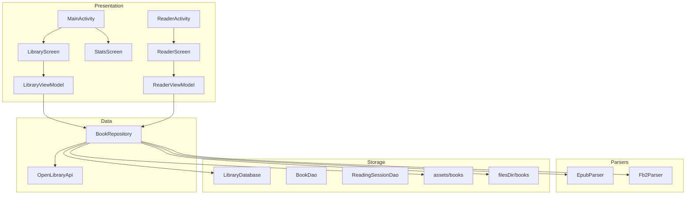
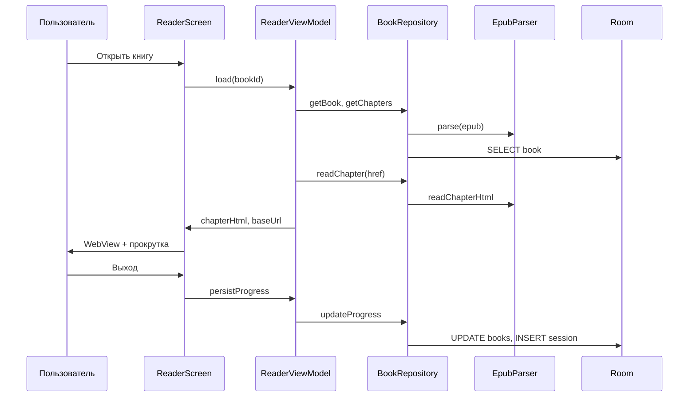

# Диаграмма файлов приложения

## Диаграмма компонентов



## Структура каталогов

```
Library/
├── app/
│   ├── src/main/
│   │   ├── assets/books/          # Предустановленные EPUB
│   │   ├── java/com/example/library/
│   │   │   ├── MainActivity.kt
│   │   │   ├── ReaderActivity.kt
│   │   │   ├── LibraryApplication.kt
│   │   │   ├── api/               # Open Library
│   │   │   ├── data/              # Repository, Room
│   │   │   ├── parser/            # EPUB, FB2
│   │   │   └── ui/                # Compose, ViewModel
│   │   └── res/
│   └── src/test/                  # Unit-тесты
├── books/                         # Исходные EPUB проекта
├── database/schema.sql
├── docs/
│   ├── presentation.md
│   └── screenshots/               # Скриншоты для wiki
├── wiki/                          # Документация wiki
└── .github/workflows/             # CI
```

## Описание ключевых файлов

| Файл / пакет | Назначение |
|--------------|------------|
| `MainActivity.kt` | Точка входа, навигация: каталог ↔ статистика |
| `ReaderActivity.kt` | Полноэкранная читалка |
| `LibraryApplication.kt` | Инициализация БД и репозитория |
| `BookRepository.kt` | Импорт, чтение глав, прогресс, статистика |
| `EpubParser.kt` | Разбор ZIP/OPF, обложка, HTML глав |
| `Fb2Parser.kt` | Разбор XML FictionBook |
| `OpenLibraryApi.kt` | HTTP-запросы к openlibrary.org |
| `LibraryDatabase.kt` | Room: books, reading_sessions |
| `ui/screens/LibraryScreen.kt` | Список книг, FAB, удаление |
| `ui/screens/ReaderScreen.kt` | WebView-читалка |
| `ui/screens/StatsScreen.kt` | Статистика за месяц |
| `ui/ReaderWebView.kt` | WebView с поддержкой прокрутки в Compose |

## Поток данных при чтении


