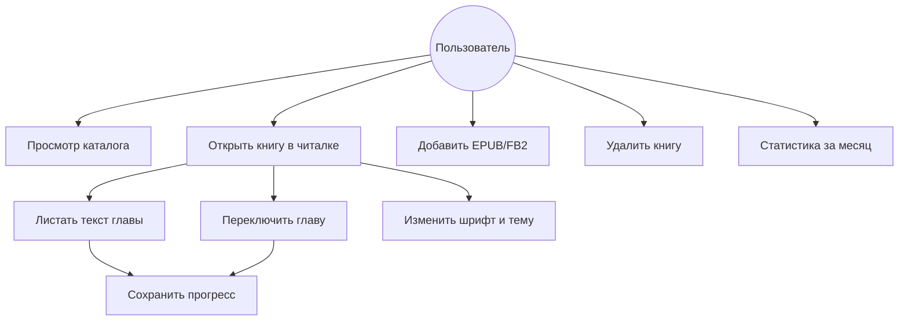
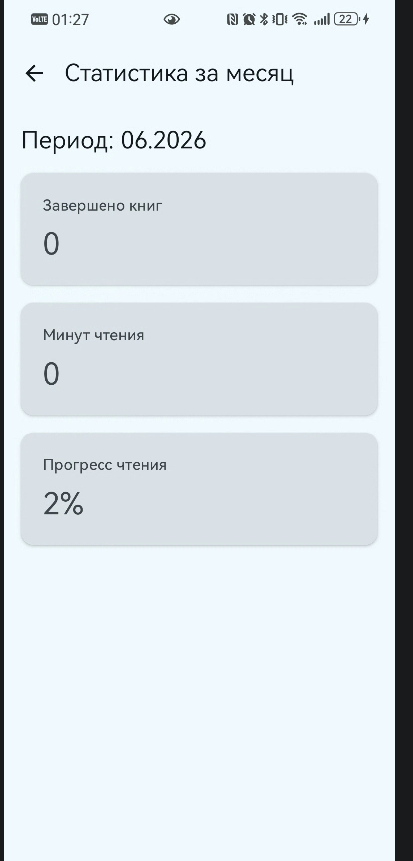

# Функциональные требования

## Постановка задачи

Разработать мобильное Android-приложение «Библиотека» для чтения и учёта электронных книг форматов EPUB и FB2: каталог с обложками, встроенная читалка, сохранение прогресса, статистика чтения за месяц, импорт файлов с устройства.

## Акторы

| Актор | Описание |
|-------|----------|
| Пользователь | Читает книги, добавляет и удаляет записи в библиотеке, просматривает статистику |

## Диаграмма Use Case

## Функциональные требования

| ID | Требование | Приоритет |
|----|------------|-----------|
| FR-01 | Отображать список книг с названием, автором, обложкой и прогрессом | Обязательно |
| FR-02 | Импортировать предустановленные EPUB из assets при первом запуске | Обязательно |
| FR-03 | Добавлять книги EPUB/FB2 с устройства через FAB «+» | Обязательно |
| FR-04 | Открывать книгу в полноэкранной читалке (`ReaderActivity`) | Обязательно |
| FR-05 | Прокручивать текст главы вертикальным жестом | Обязательно |
| FR-06 | Переключать главы кнопками «вперёд» / «назад» | Обязательно |
| FR-07 | Менять размер шрифта и светлую/тёмную тему | Желательно |
| FR-08 | Сохранять прогресс (глава, позиция, %) при выходе из читалки | Обязательно |
| FR-09 | Показывать статистику за текущий месяц | Обязательно |
| FR-10 | Удалять книгу из библиотеки | Обязательно |
| FR-11 | Дополнять метаданные через Open Library API | Желательно |

## Текстовые сценарии

### UC-1 Просмотр каталога

| Шаг | Действие | Результат |
|-----|----------|-----------|
| 1 | Пользователь запускает приложение | Открывается `MainActivity`, экран «Библиотека» |
| 2 | Система загружает книги из Room | Если БД пуста — импорт из `assets/books/` |
| 3 | — | Отображается список карточек с обложкой и прогрессом |

### UC-2 Чтение книги

| Шаг | Действие | Результат |
|-----|----------|-----------|
| 1 | Пользователь нажимает на карточку книги | Открывается `ReaderActivity` |
| 2 | Система загружает HTML главы из EPUB/FB2 | Текст отображается в WebView |
| 3 | Пользователь листает текст пальцем | Прокрутка внутри главы |
| 4 | Пользователь нажимает стрелки в шапке | Загружается предыдущая/следующая глава |
| 5 | Пользователь выходит назад | Прогресс сохраняется в БД |

### UC-3 Добавление книги

| Шаг | Действие | Результат |
|-----|----------|-----------|
| 1 | Пользователь нажимает FAB «+» | Открывается системный выбор файла |
| 2 | Выбирает `.epub` или `.fb2` | Файл копируется во внутреннее хранилище |
| 3 | — | Парсинг метаданных, обложки, запись в Room |
| 4 | — | Snackbar «Книга добавлена» |

### UC-4 Статистика за месяц

| Шаг | Действие | Результат |
|-----|----------|-----------|
| 1 | Пользователь нажимает иконку диаграммы в шапке | Экран «Статистика за месяц» |
| 2 | Система считает данные за текущий календарный месяц | Карточки: завершённые книги, минуты, прогресс % |

## Соответствие требованиям лабораторной ПМВС

| Требование лабораторной | Реализация в проекте |
|-------------------------|----------------------|
| Несколько Activity / фрагментов | `MainActivity`, `ReaderActivity`, навигация Compose |
| Touch-интерфейс | FAB, карточки, прокрутка WebView, кнопки читалки |
| База данных | Room: `books`, `reading_sessions` |
| Многопоточность | Coroutines, `Dispatchers.IO` |
| Внешний API | Open Library (OkHttp) |
| Jetpack Compose | Каталог, статистика |
| Git, CI, тесты, APK | GitHub Actions, JUnit, Robolectric |
| Документация README / wiki | README, wiki, скриншоты |

## Распределение задач в команде

| Задача | Головина Е. | Галяш А. |
|--------|:-----------:|:--------:|
| UI Compose (каталог, статистика) | ✓ | ✓ |
| Читалка WebView, навигация по главам | ✓ | |
| Парсеры EPUB / FB2 | ✓ | |
| Room, репозиторий, прогресс | | ✓ |
| Open Library API | | ✓ |
| Тесты, GitHub Actions | ✓ | ✓ |
| Документация, wiki, скриншоты | ✓ | ✓ |
