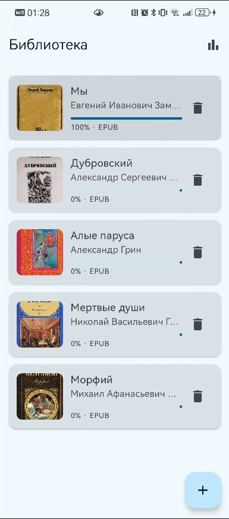
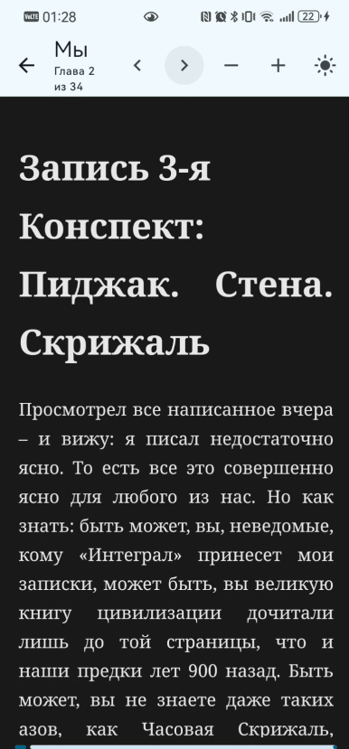
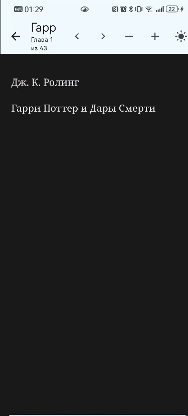
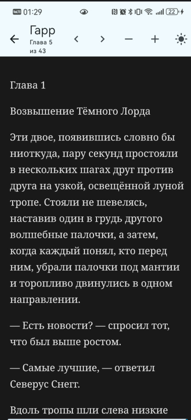
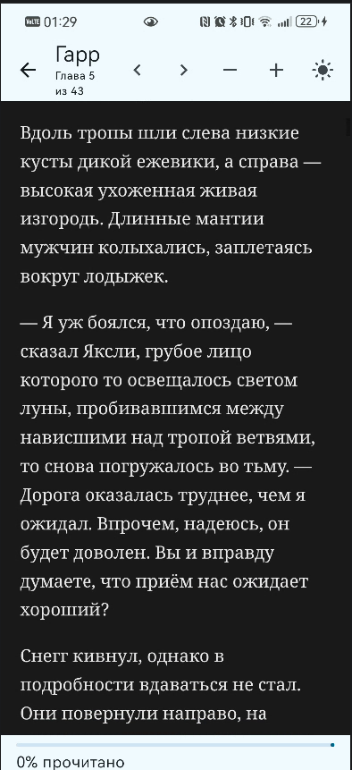

# Скриншоты приложения

Галерея экранов приложения «Библиотека» для отчёта и wiki.

## Главный экран — каталог

Список книг с обложками, автором, индикатором прогресса и кнопкой удаления. В шапке — переход к статистике, внизу справа — добавление книги (FAB «+»).

После чтения книги «Мы» прогресс отображается как 100%:

Разный прогресс по книгам в одной библиотеке (например, «Дубровский» 7%, «Мы» 100%, остальные 0%):

## Добавление книги

Выбор файла EPUB/FB2 через системный файловый менеджер и уведомление об успешном импорте:

## Читалка

Открытие книги, чтение главы, прокрутка текста, переключение глав стрелками, настройка шрифта и темы:

Импортированная книга (EPUB) в тёмной теме:

## Статистика за месяц

Экран месячной статистики: завершённые книги, минуты чтения, средний прогресс библиотеки.

До завершения чтения:

После прочтения книги до конца:

